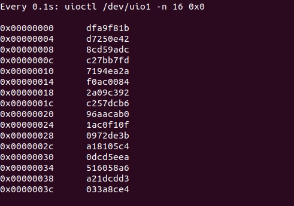

# PyUIO

Python module for UIO devices.

Currently it is only a quick test for a proof of concept. **API is not stable**.

See `tests/test.py` running on a ZCU102, writing random 32-bit data to 16 registers:

